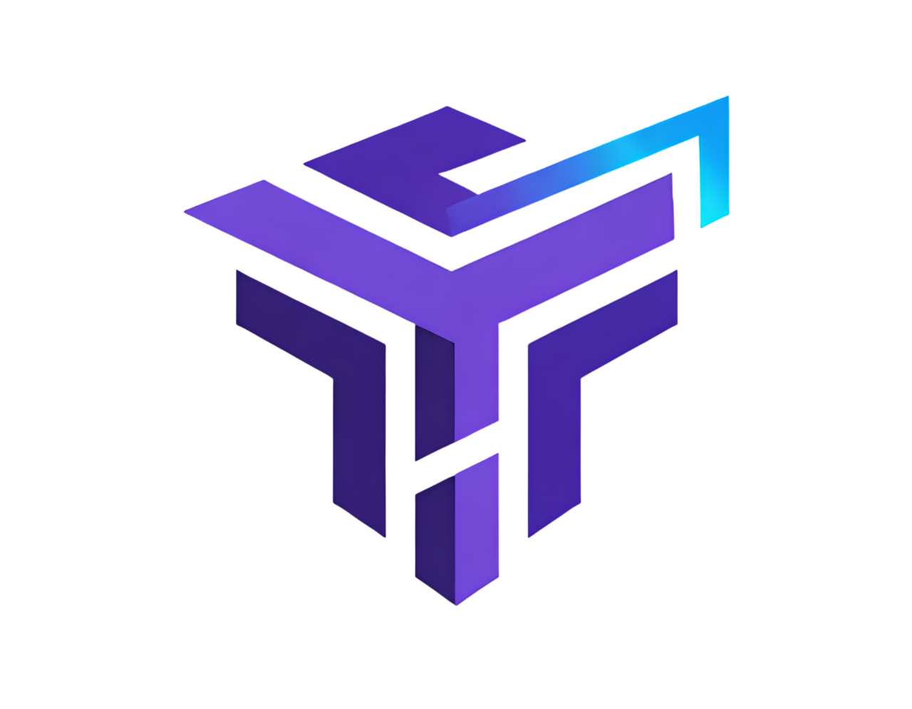

**Choose your language:** [Português](README.md) | [English](README.en.md)

# terraview: Security Scanning and AI Review for Terraform Plans

[](LICENSE)
[](https://golang.org)

## Overview

**terraview** is an open-source command-line tool that performs **security analysis of Terraform plans**, combining external scanners (Checkov, tfsec, Terrascan, KICS) with intelligent AI review via multiple providers (Ollama, Gemini, Claude, DeepSeek, OpenRouter).

Scanners run by default. AI is opt-in. Single binary, no dependencies.

Built for DevOps, SRE and Platform Engineering teams who want to ensure security and compliance before any `terraform apply`.

## Key Features

- **Security Scanners**: Automatic integration with Checkov, tfsec, Terrascan and KICS — detects what's installed and runs automatically with formal precedence
- **Formal Tool Precedence**: Trust hierarchy across 4 tiers — scanners (Tier 1-2) > deterministic rules (Tier 3) > AI (Tier 4)
- **Scanner × AI Conflict Resolution**: When scanner and AI disagree on severity, scanner precedence wins automatically; agreements boost confidence to 100%
- **Risk Clusters**: Findings grouped by resource with severity-weighted risk scores and cross-tool agreement multipliers
- **Interactive Setup**: `terraview setup` shows scanner status, tool precedence, available AI providers and install instructions
- **Multi-Provider AI**: Supports Ollama (local), Gemini, Claude, DeepSeek and OpenRouter with interactive selection
- **Zero Configuration**: Auto-detects Terraform projects and runs `init + plan + show` automatically
- **Interactive Provider Selector**: `terraview provider list` opens an arrow-key picker to choose provider and model
- **Detailed Scorecard**: Security, Compliance, Maintainability and Overall scores on a 0-10 scale
- **Infrastructure Diagram**: `--diagram` generates an ASCII diagram of the planned infrastructure
- **Blast Radius**: `--blast-radius` analyzes the impact radius of changes
- **Code Smells**: `--smell` detects infrastructure design anti-patterns
- **Score Trends**: `--trend` tracks and displays score trends over time
- **Native CI/CD**: Ready-to-use integration with GitHub Actions and GitLab CI via semantic exit codes
- **Auto-Update**: `terraview upgrade` fetches and installs the latest release from GitHub
- **Native `tv` alias**: `tv` symlink installed automatically — `tv plan` works exactly like `terraview plan`

## Installation

A single command works on **Linux, macOS, and Windows** (Git Bash / WSL):

```bash
curl -sSL https://raw.githubusercontent.com/leonamvasquez/terraview/main/install.sh | bash
```

The script automatically detects your OS and architecture, downloads the correct binary, installs it, and creates the `tv` alias.

<details>
<summary>Windows — PowerShell alternative</summary>

```powershell
irm https://raw.githubusercontent.com/leonamvasquez/terraview/main/install.ps1 | iex
```

> If PowerShell complains about execution policy, run first:
> ```powershell
> Set-ExecutionPolicy -ExecutionPolicy RemoteSigned -Scope CurrentUser
> ```

</details>

<details>
<summary>Manual download</summary>

```bash
# Replace <VERSION>, <OS> and <ARCH> for your system
# OS: linux, darwin, windows | ARCH: amd64, arm64
curl -Lo terraview.tar.gz https://github.com/leonamvasquez/terraview/releases/download/<VERSION>/terraview-<OS>-<ARCH>.tar.gz
tar -xzf terraview.tar.gz
sudo mv terraview-<OS>-<ARCH> /usr/local/bin/terraview
```

</details>

### Build from source

```bash
git clone https://github.com/leonamvasquez/terraview.git
cd terraview
make install
```

### Install the local AI runtime (Ollama)

```bash
terraview provider install
```

After installation:

```bash
terraview version   # or: tv version
terraview --help
```

## Getting Started

```bash
# Check environment: scanners, precedence, AI providers
terraview setup

# Navigate to any Terraform project
cd my-terraform-project

# Analyze the plan (runs terraform init + plan + scanners automatically)
terraview plan

# Use the short alias
tv plan

# Analyze an existing plan.json
terraview plan --plan plan.json

# Scanners + AI review
terraview plan --ai

# Choose an AI provider
terraview plan --ai --provider gemini
terraview plan --ai --provider claude
terraview plan --ai --provider openrouter

# Run specific scanners
terraview plan --scanners checkov,tfsec

# Infrastructure diagram
terraview plan --diagram

# Blast radius analysis
terraview plan --blast-radius

# Strict mode (HIGH findings also return exit code 2)
terraview plan --strict

# Review and apply
terraview apply
```

## Commands

### Global Flags

The following flags are available in **all** subcommands:

| Flag | Short | Description |
|------|-------|-------------|
| `--dir` | `-d` | Terraform workspace directory (default: `.`) |
| `--verbose` | `-v` | Enable verbose output |
| `--br` | | Force output in Brazilian Portuguese (pt-BR) |
| `--no-color` | | Disable colored output |

```bash
terraview plan --dir ./infrastructure/prod     # analyze specific directory
terraview drift -d ./modules/vpc               # short form -d
terraview plan --no-color --format json        # colorless output for pipelines
terraview plan --br                            # force pt-BR output
```

### `terraview plan`

Analyzes a Terraform plan with security scanners and optional AI review.

If `--plan` is not provided, terraview automatically:
1. Detects `.tf` files in the current directory
2. Runs `terraform init` (if needed)
3. Runs `terraform plan -out=tfplan`
4. Exports `terraform show -json tfplan > plan.json`
5. Runs scanners and the review pipeline

```bash
terraview plan                                # auto-detection + scanners
terraview plan --plan plan.json               # use existing plan.json
terraview plan --ai                           # scanners + AI review
terraview plan --ai --provider gemini         # use Gemini
terraview plan --ai --model mistral:7b        # specific model
terraview plan --scanners checkov,tfsec       # specific scanners
terraview plan --diagram                      # infrastructure diagram
terraview plan --blast-radius                 # impact radius
terraview plan --smell                        # detect code smells
terraview plan --trend                        # score trends
terraview plan --explain                      # natural language explanation (implies --ai)
terraview plan --second-opinion               # AI validates scanner findings (implies --ai)
terraview plan --format compact               # minimal output
terraview plan --format json                  # JSON output only
terraview plan --format sarif                 # SARIF output for CI
terraview plan --output ./reports             # output directory for review.json/.md
terraview plan --strict                       # HIGH returns exit code 2
terraview plan --safe                         # safe mode (light model)
terraview plan --profile prod                 # production review profile
terraview plan --findings checkov.json        # import external findings
terraview plan --timeout 180                  # AI request timeout in seconds
terraview plan --temperature 0.1              # AI model temperature (0.0–1.0)
```

> **Alias:** `terraview review` works as an alias for `terraview plan`.

### `terraview apply`

Runs a full review then conditionally applies the plan.

- **Blocks** if any CRITICAL findings are detected
- Displays a summary and asks for confirmation
- Use `--non-interactive` in CI/CD pipelines

```bash
terraview apply                                    # interactive
terraview apply --non-interactive                  # CI mode (no confirmation)
terraview apply --ai                               # AI review + apply
terraview apply --ai --provider gemini             # use Gemini
terraview apply --diagram                          # infrastructure diagram
terraview apply --blast-radius                     # impact radius
terraview apply --explain                          # natural language explanation
terraview apply --profile prod                     # production review profile
terraview apply --findings checkov.json            # import external findings
terraview apply --safe                             # safe mode (light model)
terraview apply --format json                      # JSON output only
```

### `terraview validate`

Runs a deterministic validation suite (no AI dependency):

1. `terraform fmt -check` — formatting check
2. `terraform validate` — syntax validation
3. `terraform test` — native tests (Terraform 1.6+)
4. Security Scanners — external scanner evaluation

```bash
terraview validate
terraview validate -v                     # verbose mode
```

> **Alias:** `terraview test` works as an alias for `terraview validate`.

### `terraview drift`

Detects and classifies infrastructure drift.

```bash
terraview drift
terraview drift --plan plan.json
terraview drift --intelligence            # advanced classification + risk score
terraview drift --format compact
terraview drift --format json
```

### `terraview explain`

Generates a comprehensive natural-language explanation of your infrastructure using AI.

```bash
terraview explain
terraview explain --plan plan.json
terraview explain --provider gemini
terraview explain --format json
```

### Provider Management

#### `terraview provider list`

Opens an **interactive picker** with arrow keys to choose the default provider and model. The choice is saved globally to `~/.terraview/.terraview.yaml`.

```bash
terraview provider list                            # interactive selection
terraview provider use gemini gemini-2.0-flash     # non-interactive (scripts/CI)
terraview provider current                         # show active config
terraview provider test                            # validate connectivity
```

> **Alias:** `terraview ai` works as an alias for `terraview provider`.

#### `terraview provider install` / `terraview provider uninstall`

```bash
terraview provider install      # install Ollama + pull default model
terraview provider uninstall    # remove Ollama and its data
```

### `terraview setup`

Displays an interactive environment diagnostic: available scanners, tool precedence hierarchy, and configured AI providers.

```bash
terraview setup              # English diagnostic
terraview setup --br         # Portuguese diagnostic
```

Example output:

```
  terraview setup
  ═══════════════

  Security Scanners

  [✓] checkov      3.2.504
  [✗] tfsec        Install with: brew install tfsec
  [✗] terrascan    Install with: brew install terrascan
  [✗] kics         Install with: brew install kics

  Tool Precedence
  (lower number = higher priority)

  ● 1. Checkov
  ○ 2. tfsec/Trivy
  ○ 3. Terrascan
  ○ 4. KICS
  ● 5. Deterministic rules
  ● 6. AI analysis
```

### Utilities

```bash
terraview version          # version info
terraview upgrade          # self-update from GitHub
```

## Configuration (.terraview.yaml)

Local file in the project directory (overrides global) or global at `~/.terraview/.terraview.yaml`:

```yaml
llm:
  enabled: true
  provider: ollama              # ollama, gemini, claude, deepseek, openrouter
  model: llama3.1:8b
  url: http://localhost:11434
  api_key: ""                   # for cloud providers
  timeout_seconds: 120
  temperature: 0.2

scoring:
  severity_weights:
    critical: 5
    high: 3
    medium: 1
    low: 0.5

output:
  format: pretty                # pretty, compact, json, sarif
```

## Security Scanners

terraview automatically integrates with the following external scanners. Just have them installed — terraview detects and runs them automatically (`--scanners=all`, default).

| Scanner | Description | Install |
|---------|-------------|---------|
| [Checkov](https://www.checkov.io/) | Security and compliance scanner for IaC | `pip install checkov` |
| [tfsec](https://aquasecurity.github.io/tfsec/) | Static security analysis for Terraform | `brew install tfsec` |
| [Terrascan](https://runterrascan.io/) | Compliance violation detector | `brew install terrascan` |
| [KICS](https://kics.io/) | Keeping Infrastructure as Code Secure | `brew install kics` |

Findings from all scanners are normalized, aggregated, and presented in a unified scorecard.

```bash
terraview plan                              # runs all available scanners (--scanners=all)
terraview plan --scanners checkov,tfsec     # run only specific scanners
terraview plan --findings checkov.json      # import findings from external run
```

### Tool Precedence

When multiple sources detect the same resource, terraview applies a formal trust hierarchy:

| Tier | Rank | Source | Confidence Weight |
|------|------|--------|-------------------|
| Tier 1 | 1 | Checkov | 1.00 |
| Tier 1 | 2 | tfsec / Trivy | 0.95 |
| Tier 2 | 3 | Terrascan | 0.85 |
| Tier 2 | 4 | KICS | 0.80 |
| Tier 3 | 5 | Deterministic rules | 0.70 |
| Tier 4 | 6 | AI (LLM) | 0.50 |

### Conflict Resolution (Scanner × AI)

When `--ai` is active, the pipeline resolves conflicts automatically:

| Scenario | Action | Confidence |
|----------|--------|------------|
| Scanner and AI agree (same severity ±1 level) | **Confirmed** — confidence boost | 1.00 |
| Scanner and AI disagree on severity | **Scanner wins** — formal precedence | Scanner weight |
| Only scanner detected | **Scanner-only** — kept as-is | Scanner weight |
| Only AI detected | **AI-only** — kept with lower confidence | 0.50 |

### Risk Clusters

Findings are grouped by resource into risk clusters. Resources with multiple high-severity findings and cross-tool agreement receive a higher risk score (0-100), making prioritization easier.

## Scores and Exit Codes

Scores are calculated on a 0-10 scale with weighted penalties per severity.

**Severity weights:** CRITICAL=5.0, HIGH=3.0, MEDIUM=1.0, LOW=0.5, INFO=0.0

**Categories:** Security (weight 3×), Compliance (2×), Maintainability (1.5×), Reliability (1×)

### Exit Codes

| Code | Meaning |
|------|---------|
| 0 | No issues or MEDIUM/LOW/INFO only |
| 1 | HIGH severity findings |
| 2 | CRITICAL severity findings (blocks apply) |

## CI/CD Integration

### GitHub Actions

```yaml
name: Terraform Review
on:
  pull_request:
    paths: ['**.tf']

jobs:
  review:
    runs-on: ubuntu-latest
    steps:
      - uses: actions/checkout@v4
      - name: Setup Terraform
        uses: hashicorp/setup-terraform@v3

      - name: Install Checkov
        run: pip install checkov

      - name: Install terraview
        run: curl -sSL https://raw.githubusercontent.com/leonamvasquez/terraview/main/install.sh | bash

      - name: Review plan
        run: terraview plan

      - name: Comment on PR
        if: always()
        uses: marocchino/sticky-pull-request-comment@v2
        with:
          path: review.md
```

### GitLab CI

```yaml
terraform-review:
  stage: validate
  script:
    - pip install checkov
    - curl -sSL https://raw.githubusercontent.com/leonamvasquez/terraview/main/install.sh | bash
    - terraview plan
  artifacts:
    paths: [review.json, review.md]
    when: always
```

## Architecture

```
┌──────────────────────────────────────────────────────────────┐
│                        terraview CLI                         │
│  plan │ apply │ validate │ drift │ explain │ provider │ setup│
└──────────────────────────┬───────────────────────────────────┘
                           │
              ┌────────────┴─────────────┐
              ▼                          ▼
    ┌──────────────────────┐   ┌──────────────────────┐
    │  Security Scanners   │   │    AI Providers       │
    │  Checkov │ tfsec     │   │  Ollama │ Gemini      │
    │  Terrascan │ KICS    │   │  Claude │ DeepSeek    │
    └──────────┬───────────┘   │  OpenRouter           │
               │               └──────────┬────────────┘
               ▼                          ▼
    ┌──────────────────────────────────────────────┐
    │          Precedence Sort (by tier)            │
    └──────────────────────┬───────────────────────┘
                           ▼
    ┌──────────────────────────────────────────────┐
    │       Conflict Resolver (scanner × AI)        │
    │  confirmed │ scanner-priority │ ai-only        │
    └──────────────────────┬───────────────────────┘
                           ▼
    ┌──────────────────────────────────────────────┐
    │        Risk Cluster Builder (by resource)     │
    └──────────────────────┬───────────────────────┘
                           ▼
    ┌──────────────────────────────────────────────┐
    │          Aggregator + Scorer + Meta           │
    │           review.json / .md / .sarif          │
    └──────────────────────────────────────────────┘
```

## Development

```bash
make build        # build for current platform
make test         # run tests with race detection
make test-short   # fast tests
make coverage     # coverage report
make dist         # build for all platforms
make install      # install locally (~/.local/bin)
make help         # list all targets
```

## Roadmap

- [x] SARIF output format
- [x] Score history and trend tracking
- [x] Customizable scoring profiles
- [x] External scanner integration (Checkov, tfsec, Terrascan, KICS)
- [x] ASCII infrastructure diagram
- [x] Blast radius analysis
- [x] Code smell detection
- [x] Interactive setup (`terraview setup`)
- [x] Formal tool precedence (4 tiers)
- [x] Scanner × AI conflict resolution
- [x] Risk Clusters by resource
- [x] AI-centric pipeline: Precedence → Resolver → Cluster → Aggregator
- [ ] Azure and GCP support
- [ ] Terraform module-aware analysis
- [ ] OPA/Rego policy integration

## Support and Contact

- **GitHub Issues**: [github.com/leonamvasquez/terraview/issues](https://github.com/leonamvasquez/terraview/issues)
- **GitHub Discussions**: [github.com/leonamvasquez/terraview/discussions](https://github.com/leonamvasquez/terraview/discussions)

## License

This project is distributed under the MIT License. See the [LICENSE](LICENSE) file for details.

---

## FAQ

**Q: Does terraview work offline?**
A: Yes. Scanners run locally, and when using Ollama as the AI provider, all analysis is done without sending data externally.

**Q: Do I need Terraform installed?**
A: Yes, if you want automatic plan generation (`terraview plan` without `--plan`). If you already have a `plan.json`, Terraform is not required.

**Q: Do I need any scanner installed?**
A: Recommended but not required. terraview automatically detects which scanners are available (`--scanners=all`, default). Use `terraview setup` to check status. Without any scanner, only the AI pipeline can be used with `--ai`.

**Q: How do I configure a cloud provider (Gemini, Claude, etc.)?**
A: Run `terraview provider list`, select the provider with arrow keys and confirm. terraview will show which environment variable to set (e.g., `GEMINI_API_KEY`).

**Q: Can I use terraview in monorepos with multiple workspaces?**
A: Yes. Use `--dir` to specify the workspace or `--plan` with a previously generated `plan.json`.

**Q: How do I update to the latest version?**
A: Run `terraview upgrade`. It checks, downloads and installs automatically.

**Q: What is the `tv` alias?**
A: During installation, a `tv -> terraview` symlink is created. You can use `tv plan`, `tv provider list`, etc. as a shorthand.

**Q: What's the difference between `terraview plan` and `terraview validate`?**
A: `plan` runs scanners and optionally AI for a full analysis. `validate` runs quick deterministic checks (fmt, validate, test, scanners) without AI support — ideal for pre-commit or fast CI.

**Q: What happens when scanner and AI disagree?**
A: terraview applies automatic conflict resolution. Scanners have formal precedence (Tier 1-2) over AI (Tier 4). When both detect the same issue and agree, confidence is boosted to 100%. When they disagree on severity, the scanner's severity wins.

**Q: What is `terraview setup`?**
A: A diagnostic command that shows which scanners are installed, the tool precedence hierarchy, and which AI providers are available — useful for verifying your environment before running analyses.
