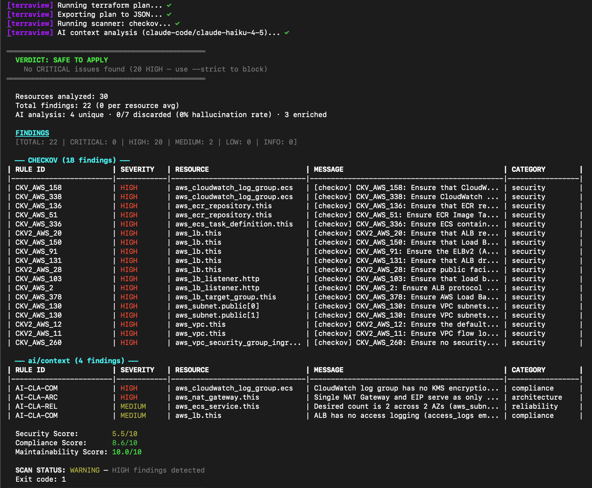
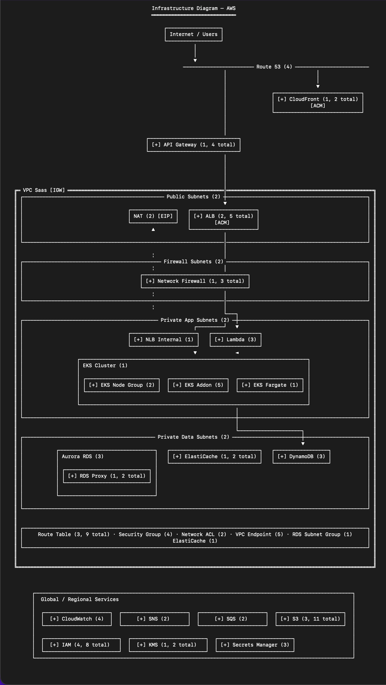

<picture>
  <source media="(prefers-color-scheme: dark)" srcset=".github/assets/terraview-logo-dark-theme.png">
  <source media="(prefers-color-scheme: light)" srcset=".github/assets/terraview-logo-white-theme.png">
  
</picture>

**Escolha seu idioma:** [Português](README.md) | [English](README.en.md)

[](LICENSE)
[](https://golang.org)
[](https://github.com/leonamvasquez/terraview/releases/latest)
[](https://github.com/leonamvasquez/terraview/actions/workflows/ci.yml)
[](https://goreportcard.com/report/github.com/leonamvasquez/terraview)
[](https://codecov.io/gh/leonamvasquez/terraview)
[](https://slsa.dev)
[](https://scorecard.dev/viewer/?uri=github.com/leonamvasquez/terraview)

O Terraview é uma ferramenta Open Source de análise de segurança para planos Terraform que combina scanners estáticos (Checkov, tfsec, Terrascan) com análise contextual por IA executada **em paralelo**.

Ele inspeciona infraestrutura provisionada com Terraform, detecta misconfigurations de segurança e compliance usando scanners open-source consagrados, e automaticamente enriquece o resultado com análise contextual multi-provider de IA quando um provider está configurado.

O Terraview roda como binário único, sem dependências externas. Quando um provider de IA está configurado, scanner e IA rodam em paralelo automaticamente.

## Sumário

- [Funcionalidades](#funcionalidades)
- [Exemplos](#exemplos)
- [Início Rápido](#início-rápido)
- [Instalação](#instalação)
- [Atualização](#atualização)
- [Shell Completions](#shell-completions)
- [Uso](#uso)
- [Scan](#scan)
- [Status](#status)
- [Fix](#fix)
- [Diagram](#diagram)
- [Explain](#explain)
- [History](#history)
- [MCP Server](#mcp-server)
- [Gerenciamento de Providers](#gerenciamento-de-providers)
- [Gerenciamento de Scanners](#gerenciamento-de-scanners)
- [Cache de IA](#cache-de-ia)
- [Formatos de Saída](#formatos-de-saída)
- [Configuração](#configuração)
- [Scanners de Segurança](#scanners-de-segurança)
- [Providers de IA](#providers-de-ia)
- [Integração com IA por Assinatura](#integração-com-ia-por-assinatura)
- [Integração CI/CD](#integração-cicd)
- [Docker](#docker)
- [Arquitetura](#arquitetura)
- [Desenvolvimento](#desenvolvimento)
- [Contribuindo](#contribuindo)
- [Aviso](#aviso)
- [Suporte](#suporte)
- [Licença](#licença)

## Funcionalidades

- **Scanners de Segurança** — integração automática com Checkov, tfsec e Terrascan; detecta o que está instalado e executa sem configuração
- **Scanner `builtin`** — 43 regras CKV_AWS em Go puro embutidas no binário; roda sem Python, npm ou downloads externos. Fallback automático quando nenhum scanner externo está no PATH (ideal para CI air-gapped e imagens Docker mínimas)
- **Policy-as-code nativo** — regras customizadas declaradas em `.terraview.yaml` (8 operadores: `is_null`, `equals`, `contains`, `matches`, etc.) sem Rego ou Sentinel
- **Análise contextual por IA (default)** — quando um provider de IA está configurado, a IA roda **em paralelo** com o scanner, analisando relações cross-resource, cadeias de dependências e anti-patterns arquiteturais que scanners estáticos não detectam
- **IA Multi-Provider** — três categorias:
  - **API**: Ollama (local), Google Gemini, Anthropic Claude, OpenAI, DeepSeek e OpenRouter
  - **CLI (assinatura)**: Gemini CLI e Claude Code — usam sua assinatura pessoal, sem API key
  - **Custom**: qualquer API OpenAI-compatible (Grok/xAI, Groq, Mistral, Together AI, Fireworks, etc.)
- **Supressão de findings** — arquivo `.terraview-ignore` para suprimir riscos aceitos e falsos positivos de forma permanente, com escopo AND-logic por regra, recurso ou fonte (`--ignore-file`)
- **Sugestões de AI Fix** — `terraview fix plan` (dry-run) / `terraview fix apply` (interativo ou `--auto-approve`) geram e aplicam HCL corrigido para findings CRITICAL/HIGH com validação, backup e preview de diff
- **Teste de integração automático** — ao selecionar um provider via `provider list`, o terraview testa conectividade e retorna feedback específico por tipo (CLI instalado, API key válida, serviço acessível)
- **Resolução de conflitos** — scanner × IA: scanner vence em caso de divergência (confidence 0.80); acordo eleva confidence para 1.00
- **Scorecard unificado** com notas de Segurança, Compliance e Manutenibilidade (0–10)
- **Vetores de risco** — extração de risco por recurso em 5 eixos: exposição de rede, criptografia, identidade, governança e observabilidade
- **Diagrama ASCII (AWS)** — visualização topológica da infraestrutura no terminal com aninhamento de VPC, tiers de subnet, setas de conexão, referências cruzadas de security groups, arestas bidirecionais, nós visuais NAT/TGW/VPN e agregação de recursos
- **Blast radius via MCP** — análise de impacto de dependências exposta para agentes de IA pela tool MCP `terraview_impact`
- **Explicação por IA** — explicação em linguagem natural da sua infraestrutura via `explain`
- **Zero configuração** — detecta projetos Terraform e executa `init + plan + show` automaticamente
- **Histórico de scans** — tracking em SQLite com sparkline de trends, comparação lado-a-lado e export CSV/JSON
- **MCP Server** — integração via Model Context Protocol para agentes de IA (Claude Code, Cursor, Windsurf) através de `terraview mcp server`
- **CI/CD nativo** — exit codes semânticos (0/1/2) + saída SARIF, JSON e Markdown para GitHub Actions, GitLab CI e Azure DevOps
- **Supply chain hardening** — SBOM (CycloneDX), assinaturas cosign, SLSA Build Provenance Level 3 em cada release
- **Bilíngue (en/pt-BR)** — flag `--br` disponível em todos os comandos
- **Atualização** pelo seu gerenciador de pacotes (`brew upgrade terraview`, `scoop update terraview`, `apt upgrade terraview`, etc.)
- **Alias `tv`** — symlink criado na instalação; `tv scan` = `terraview scan`
- **Cache de IA persistente** em disco — re-execuções do mesmo plan evitam chamadas redundantes à API (`cache status | clear`)
- **Instalação cross-platform de scanners** via `terraview scanners install --all` (Linux, macOS, Windows)

## Exemplos

### Saída de scan no CLI



<details>
<summary>Versão em texto</summary>

```
  $ terraview scan checkov
  ══════════════════════

  ┌──────────────────────────────────────────────────────┐
  │ Scorecard                                            │
  │ Segurança:        7.2 / 10   ████████░░              │
  │ Compliance:       8.5 / 10   █████████░              │
  │ Manutenibilidade: 9.0 / 10   █████████░              │
  └──────────────────────────────────────────────────────┘

  3 CRITICAL · 5 HIGH · 12 MEDIUM · 4 LOW

  ● [CRITICAL] aws_s3_bucket.data
    ✗ CKV_AWS_145   Criptografia não habilitada
    ✗ CKV2_AWS_61   Configuração de lifecycle ausente

  ● [HIGH] aws_security_group.web
    ✗ CKV_AWS_25    Ingress irrestrito na porta 22 (0.0.0.0/0)

  ✦ Análise IA (gemini-cli · paralelo)
    Risco cross-resource: bucket S3 exposto via CloudFront sem
    Origin Access Control — escalação de leitura pública possível.

  $ terraview fix apply --severity CRITICAL

  1  aws_s3_bucket.data → s3.tf

  --- s3.tf (original)
  +++ s3.tf (corrigido)
  @@ -14,6 +14,12 @@
   resource "aws_s3_bucket" "data" {
     bucket = var.bucket_name
  +
  +  server_side_encryption_configuration {
  +    rule {
  +      apply_server_side_encryption_by_default {
  +        sse_algorithm = "AES256"
  +      }
  +    }
  +  }
   }

  Aplicar? [y/N]: y
  ✓ 1 arquivo corrigido · backup em s3.tf.tvfix.bak · terraform validate passou
```

</details>

### Saída de setup

```
  terraview setup
  ═══════════════

  Scanners de Segurança

  [✓] checkov      3.2.504
  [✗] tfsec        Instale com: terraview scanners install tfsec
  [✗] terrascan    Instale com: terraview scanners install terrascan

  Providers de IA

  [✓] ollama           rodando (llama3.1:8b)
  [✓] gemini-cli       CLI gemini instalado
  [✓] claude-code      CLI claude instalado
  [✗] gemini           GEMINI_API_KEY não definida
  [✗] claude           ANTHROPIC_API_KEY não definida

  IA pronta (2 providers disponíveis)

  Início Rápido

  terraview scan checkov              # scanner + IA (default)
  terraview scan checkov --static     # somente scanner

  Instalar o que falta: terraview scanners install --all
```

## Início Rápido

### Requisitos

- Terraform >= 0.12
- Um ou mais scanners instalados (Checkov, tfsec, Terrascan) — o terraview pode instalá-los para você

### Instalação rápida

```bash
curl -sSL https://raw.githubusercontent.com/leonamvasquez/terraview/main/install.sh | bash
```

### Configurar IA

```bash
terraview provider list                     # seletor interativo + teste de conectividade
```

### Primeiro scan

```bash
cd meu-projeto-terraform
terraview scan checkov                      # scanner + IA (default quando provider configurado)
terraview scan checkov --static             # somente scanner, sem IA
terraview status                            # findings do último scan com delta
```

## Instalação

### Script de instalação (Linux, macOS, Windows WSL)

```bash
curl -sSL https://raw.githubusercontent.com/leonamvasquez/terraview/main/install.sh | bash
```

O script detecta automaticamente seu OS e arquitetura, baixa o binário correto do GitHub Releases e cria o alias `tv`.

### Homebrew (macOS / Linux)

```bash
brew install leonamvasquez/terraview/terraview
```

### Scoop (Windows)

```powershell
scoop bucket add terraview https://github.com/leonamvasquez/scoop-terraview.git
scoop install terraview
```

### APT — Debian / Ubuntu

```bash
# Adicionar repositório
curl -1sLf 'https://dl.cloudsmith.io/public/workspace-for-leonam/terraview/setup.deb.sh' | sudo bash

# Instalar
sudo apt update
sudo apt install terraview
```

### DNF / YUM — Fedora / RHEL / Amazon Linux

```bash
# Adicionar repositório
curl -1sLf 'https://dl.cloudsmith.io/public/workspace-for-leonam/terraview/setup.rpm.sh' | sudo bash

# Instalar
sudo dnf install terraview
```

### Docker

```bash
docker pull leonamvasquez/terraview:latest

# Uso
docker run --rm -v $(pwd):/workspace leonamvasquez/terraview scan checkov
```

### Windows — PowerShell (script direto)

```powershell
irm https://raw.githubusercontent.com/leonamvasquez/terraview/main/install.ps1 | iex
```

### Download manual

```bash
# Substitua <VERSION>, <OS> e <ARCH> para o seu sistema
# OS: linux, darwin, windows | ARCH: amd64, arm64
curl -Lo terraview.tar.gz https://github.com/leonamvasquez/terraview/releases/download/<VERSION>/terraview-<OS>-<ARCH>.tar.gz
tar -xzf terraview.tar.gz
sudo mv terraview /usr/local/bin/terraview
```

### Build a partir do código-fonte

```bash
git clone https://github.com/leonamvasquez/terraview.git
cd terraview
make install
```

Compila o binário, instala em `~/.local/bin/terraview`, cria o symlink `tv` e copia os prompts para `~/.terraview/prompts/`.

## Atualização

Atualize o Terraview pelo seu gerenciador de pacotes:

```bash
# Homebrew
brew upgrade leonamvasquez/terraview/terraview

# Scoop
scoop update terraview

# APT
sudo apt update && sudo apt upgrade terraview

# DNF
sudo dnf upgrade terraview
```

## Shell Completions

```bash
# Bash
terraview completion bash | sudo tee /etc/bash_completion.d/terraview > /dev/null
source /etc/bash_completion.d/terraview

# Zsh (adicione ao ~/.zshrc)
terraview completion zsh | sudo tee "${fpath[1]}/_terraview" > /dev/null

# Fish
terraview completion fish | source

# PowerShell (adicione ao seu $PROFILE)
terraview completion powershell | Out-File $PROFILE -Append
```

Depois de configurar, reabra o terminal e use `terraview <Tab>` para autocompletar comandos, flags e argumentos.

## Uso

```
$ terraview

Core Commands:
  scan        Scan de segurança + análise contextual por IA (paralelo)
  status      Mostra findings abertos do último scan
  fix         Correções geradas por IA (fix plan | fix apply)
  diagram     Gera diagrama ASCII da infraestrutura
  explain     Explicação da infraestrutura por IA

Provider Management:
  provider    Gerencia providers de IA e runtimes LLM
              provider list | use | current | test

Scanner Management:
  scanners    Gerencia scanners de segurança
              scanners list | install | default

Utilities:
  cache       Gerencia o cache de respostas de IA
              cache status | clear
  version     Mostra informações de versão
  setup       Diagnóstico interativo do ambiente

Flags:
  -d, --dir string        Diretório do workspace Terraform (default ".")
  -p, --plan string       Caminho do plan JSON (gera automaticamente se omitido)
  -f, --format string     Formato de saída: pretty, compact, json, sarif
  -o, --output string     Diretório de saída para arquivos gerados
      --provider string   Provider de IA (ollama, gemini, claude, openai, deepseek, openrouter, gemini-cli, claude-code)
      --model string      Modelo de IA a ser usado
      --br                Saída em português do Brasil (pt-BR)
      --no-color          Desabilita saída colorida
  -v, --verbose           Habilita saída verbosa
```

### Scan

Por default, o terraview roda **tanto** o scanner de segurança quanto a análise contextual por IA **em paralelo**. A IA é ativada automaticamente quando um provider está configurado (via `.terraview.yaml`, flag `--provider` ou `terraview provider use`). Se nenhum provider estiver configurado, apenas o scanner é executado.

```bash
terraview scan                              # seleciona o scanner default
terraview scan checkov                      # scan com Checkov (+ IA se configurada)
terraview scan tfsec                        # scan com tfsec
terraview scan terrascan                    # scan com Terrascan
terraview scan checkov --static             # somente scanner, desabilita IA
terraview scan checkov --plan plan.json     # usa um plan JSON existente
terraview scan checkov -f sarif             # saída SARIF para CI
terraview scan checkov --strict             # findings HIGH também retornam exit code 2
terraview scan checkov --findings ext.json  # importa findings externos Checkov/tfsec/Trivy
```

#### Definindo diretório ou arquivo de entrada

Scan do diretório atual (auto-detecta Terraform):

```bash
terraview scan checkov
```

Ou de um diretório específico:

```bash
terraview scan checkov -d /caminho/para/meu-projeto
```

Ou gerando o plan manualmente:

```bash
terraform init
terraform plan -out tf.plan
terraform show -json tf.plan > tf.json
terraview scan checkov --plan tf.json
```

Usar providers CLI (assinatura — sem API key):

```bash
terraview scan checkov --provider gemini-cli --model gemini-3
terraview scan checkov --provider claude-code --model claude-sonnet-4-5
```

### Status

Mostra os findings abertos do último scan com delta contra o scan anterior. Lê do `LastScan` persistido, portanto não re-executa o scanner.

```bash
terraview status                            # CRITICAL/HIGH + delta vs scan anterior
terraview status --all                      # inclui MEDIUM/LOW/INFO
terraview status --explain-scores           # decomposição detalhada dos scores
```

### Fix

Comando pai para correções geradas por IA. Lê findings do último scan e gera HCL corrigido. `fix plan` é dry-run (apenas diff); `fix apply` é interativo por default (y/n por fix).

```bash
terraview fix plan                          # dry-run: preview dos diffs, não escreve nada
terraview fix apply                         # interativo: y/n por fix
terraview fix apply --auto-approve          # aplica tudo sem prompts (CI/scripts)
terraview fix apply CKV_AWS_18              # apenas findings com este rule ID
terraview fix apply --severity CRITICAL     # filtra por severidade
terraview fix apply --file vpc.tf           # filtra por arquivo .tf
terraview fix apply --max 5                 # limita a quantidade de fixes gerados
```

Safeguards: pre-flight de brace-balance, backup `.tvfix.bak` por arquivo, `terraform validate` após apply, rollback automático em caso de falha de validação.

### Diagram

Gera um diagrama ASCII determinístico da infraestrutura a partir de um plan Terraform. Não requer IA. Atualmente suporta **apenas AWS**.



Dois modos de renderização disponíveis:

- **topo** (default) — visão topológica com aninhamento de VPC, tiers de subnet, setas de conexão, referências cruzadas de security groups, arestas bidirecionais, nós visuais NAT/TGW/VPN e agregação de recursos
- **flat** — visão simples baseada em camadas

```bash
terraview diagram                           # diagrama do diretório atual (modo topo)
terraview diagram --plan plan.json          # diagrama a partir de plan existente
terraview diagram --diagram-mode flat       # visão flat baseada em camadas
terraview diagram --output ./reports        # grava diagram.txt no diretório
```

### Explain

Gera uma explicação em linguagem natural da sua infraestrutura Terraform usando IA. Requer um provider configurado.

```bash
terraview explain                           # explica o projeto atual
terraview explain --plan plan.json          # explica a partir de plan existente
terraview explain --provider gemini         # usa um provider específico
terraview explain --format json             # saída estruturada em JSON
```

### History

Visualiza o histórico de scans armazenado localmente em SQLite. Cada scan registra resultados automaticamente quando o histórico está habilitado.

```bash
terraview history                           # últimos 20 scans do projeto atual
terraview history --all                     # todos os projetos
terraview history --limit 50               # limita resultados
terraview history --since 7d               # scans dos últimos 7 dias
terraview history --format json            # saída JSON

terraview history trend                     # sparkline de trends de score
terraview history compare                   # último vs scan anterior
terraview history compare --with 5          # último vs scan #5

terraview history clear                     # limpa o projeto atual
terraview history clear --before 30d       # limpa mais antigos que 30 dias

terraview history export --format csv -o scans.csv
```

Habilite no `.terraview.yaml`:

```yaml
history:
  enabled: true
  retention_days: 90
  max_size_mb: 50
```

### MCP Server

Servidor Model Context Protocol para integração com agentes de IA. Expõe as tools do terraview via JSON-RPC 2.0 sobre stdio.

```bash
terraview mcp server
```

> O alias `terraview mcp serve` continua funcionando por retrocompatibilidade.

Registrar no Claude Code:

```bash
claude mcp add terraview -- terraview mcp server
```

Registrar no Cursor (`.cursor/mcp.json`):

```json
{
  "mcpServers": {
    "terraview": {
      "command": "terraview",
      "args": ["mcp", "server"]
    }
  }
}
```

Expõe 11 tools: `terraview_scan`, `terraview_explain`, `terraview_diagram`, `terraview_history`, `terraview_history_trend`, `terraview_history_compare`, `terraview_impact`, `terraview_cache`, `terraview_scanners`, `terraview_fix_suggest`, `terraview_version`.

### Gerenciamento de Providers

```bash
terraview provider list                     # seletor interativo (provider + modelo + teste de conectividade)
terraview provider use gemini gemini-2.5-pro  # define provider via CLI (não interativo)
terraview provider use ollama llama3.1:8b   # define provider local
terraview provider current                  # mostra a configuração atual
terraview provider test                     # testa conectividade do provider configurado
```

O comando `provider list` executa um **teste de integração automático**. Se o teste falhar, uma mensagem de diagnóstico é exibida:

- **CLI não instalado** → mostra comando de instalação (`npm install -g ...`)
- **API key ausente** → mostra variável de ambiente a definir
- **API key inválida / erro de rede** → sugere verificar credenciais e conectividade
- **Serviço local inacessível** → sugere verificar se o serviço está rodando

```
  [terraview] Testando conectividade com gemini-cli (gemini-3)... ✓

  ✓  Teste de integração passou — CLI "gemini" instalado e pronto.
  ✓  Provider default: gemini-cli  modelo: gemini-3
     Salvo em: ~/.terraview/.terraview.yaml
```

### Gerenciamento de Scanners

```bash
terraview scanners list                     # lista scanners com status de instalação
terraview scanners install checkov          # instala um scanner específico
terraview scanners install tfsec terrascan  # instala múltiplos scanners
terraview scanners install --all            # instala todos os scanners faltantes
terraview scanners install --all --force    # reinstala todos forçadamente
terraview scanners default checkov          # define o scanner default
terraview scanners default                  # mostra o default atual
```

### Cache de IA

O Terraview possui um cache persistente de respostas de IA em disco (`~/.terraview/cache/`). Quando habilitado, re-execuções do mesmo plan reutilizam a resposta anterior sem chamadas adicionais à API.

```bash
terraview cache status                      # mostra estatísticas do cache (entries, tamanho, datas)
terraview cache clear                       # limpa todas as respostas de IA em cache
```

Habilite no `.terraview.yaml`:

```yaml
llm:
  cache: true            # habilita cache persistente
  cache_ttl_hours: 24    # TTL em horas (default: 24)
```

### Outros comandos

```bash
terraview setup                             # diagnóstico do ambiente
terraview version                           # versão, runtime Go, OS/arch
```

### Exit Codes

| Código | Significado |
|--------|-------------|
| `0`  | Sem issues ou apenas MEDIUM/LOW/INFO |
| `1`  | Findings de severidade HIGH |
| `2`  | Findings CRITICAL (bloqueia apply) |

## Formatos de Saída

```bash
terraview scan checkov                      # saída pretty (default)
terraview scan checkov -f compact           # resumo em uma linha
terraview scan checkov -f json              # JSON (review.json)
terraview scan checkov -f sarif             # SARIF (review.sarif.json) para a aba Security do GitHub
terraview scan checkov -o ./reports         # grava review.json + review.md em ./reports
```

Todo scan gera `review.json` e `review.md`. A saída SARIF é gerada quando `-f sarif` é usado.

## Configuração

O Terraview pode ser configurado com um arquivo YAML. Por default, ele procura `.terraview.yaml` nos seguintes locais (em ordem de precedência):

1. Diretório do projeto (passado via `--dir`)
2. Diretório de trabalho atual
3. Home do usuário (`~/.terraview/.terraview.yaml`)

Exemplo de configuração (veja [`examples/.terraview.yaml`](examples/.terraview.yaml) para referência completa com todos os campos documentados):

> **AVISO:** Nunca faça commit de `api_key` diretamente no `.terraview.yaml`. Prefira variáveis de ambiente (`ANTHROPIC_API_KEY`, `GEMINI_API_KEY`, etc.) ou adicione `.terraview.yaml` ao seu `.gitignore`. O Terraview emite um aviso no stderr quando detecta `api_key` no arquivo de configuração.

```yaml
llm:
  enabled: true
  provider: ollama              # ollama, gemini, claude, openai, deepseek, openrouter, gemini-cli, claude-code
  model: llama3.1:8b            # modelo específico do provider
  url: http://localhost:11434   # URL customizada (relevante apenas para ollama)
  # api_key: ""                 # prefira variáveis de ambiente (veja aviso acima)
  timeout_seconds: 120          # timeout de chamadas LLM
  temperature: 0.2              # 0.0 a 1.0 (menor = mais determinístico)
  max_resources: 30             # máximo de recursos no prompt de IA (default: 30)
  cache: false                  # habilita cache persistente de respostas de IA
  cache_ttl_hours: 24           # TTL do cache em horas (default: 24)
  ollama:
    num_ctx: 4096               # janela de contexto do modelo (default: 4096)
    max_threads: 0              # 0 = usa todas as CPUs
    max_memory_mb: 0            # 0 = sem limite
    min_free_memory_mb: 1024    # memória livre mínima para iniciar o Ollama

scanner:
  default: checkov              # scanner default para "terraview scan"

scoring:
  severity_weights:
    critical: 5.0
    high: 3.0
    medium: 1.0
    low: 0.5

rules:
  required_tags:                # tags obrigatórias em todos os recursos
    - Environment
    - Owner
    - CostCenter
  disabled_rules:               # silencia rule IDs específicos
    - CKV_AWS_79
  # enabled_rules: []           # se definido, apenas estas regras são avaliadas
  custom:                       # policy-as-code: regras nativas (sem Rego/Sentinel)
    - id: ORG_S3_001
      severity: HIGH
      category: security
      message: "Bucket S3 sem tag 'DataClassification'"
      remediation: "Adicione tags = { DataClassification = 'public|internal|confidential' }"
      resource_type: aws_s3_bucket
      condition:
        field: tags.DataClassification
        op: not_null

output:
  format: pretty                # pretty, compact, json
```

### Variáveis de ambiente

| Variável             | Provider    | Descrição                   |
|----------------------|-------------|-----------------------------|
| `GEMINI_API_KEY`     | Gemini      | API key do Google Gemini    |
| `ANTHROPIC_API_KEY`  | Claude      | API key da Anthropic        |
| `OPENAI_API_KEY`     | OpenAI      | API key da OpenAI           |
| `DEEPSEEK_API_KEY`   | DeepSeek    | API key do DeepSeek         |
| `OPENROUTER_API_KEY` | OpenRouter  | API key do OpenRouter       |
| `NO_COLOR`           | (global)    | Desabilita saída colorida   |

O Ollama não requer API key. Os providers `gemini-cli` e `claude-code` autenticam pelas respectivas assinaturas de CLI.

## Scanners de Segurança

| Scanner | Descrição | Instalação |
|---------|-----------|------------|
| **builtin** | Scanner em Go puro embutido no terraview — 43 regras CKV_AWS, sem dependências externas | já incluído no binário |
| [Checkov](https://www.checkov.io/) | Scanner de segurança e compliance para IaC | `terraview scanners install checkov` |
| [tfsec](https://aquasecurity.github.io/tfsec/) | Análise estática de segurança para Terraform | `terraview scanners install tfsec` |
| [Terrascan](https://runterrascan.io/) | Detector de violações de compliance | `terraview scanners install terrascan` |

Os findings de todos os scanners são normalizados, deduplicados e apresentados em um scorecard unificado. O `builtin` cobre S3, RDS, EC2, Security Groups, Lambda, CloudFront, DynamoDB, ElastiCache, CloudWatch, EKS, ECS, ECR, SQS, SNS, IAM, CloudTrail, OpenSearch, MSK e RDS Cluster — útil para ambientes air-gapped onde scanners externos não podem ser instalados.

```bash
terraview scanners install --all            # instala todos
terraview scanners install checkov          # instala específico
terraview scanners default checkov          # define como default
terraview scanners list                     # verifica status
```

## Providers de IA

O Terraview suporta **múltiplos providers de IA** organizados em quatro categorias. Com OpenRouter e Custom, você tem acesso a praticamente qualquer modelo de IA do mercado:

### Providers API (requerem API key)

| Provider | Variável de ambiente | Modelo default | Modelos de exemplo |
|----------|---------------------|----------------|--------------------|
| **gemini** | `GEMINI_API_KEY` | gemini-2.5-flash | gemini-2.5-flash, gemini-2.5-pro, gemini-2.0-flash |
| **claude** | `ANTHROPIC_API_KEY` | claude-haiku-4-5 | claude-haiku-4-5, claude-sonnet-4-6, claude-opus-4-6 |
| **openai** | `OPENAI_API_KEY` | gpt-4o-mini | gpt-4o-mini, gpt-4o, o3-mini |
| **deepseek** | `DEEPSEEK_API_KEY` | deepseek-v3.2 | deepseek-chat, deepseek-reasoner |
| **openrouter** | `OPENROUTER_API_KEY` | google/gemini-2.5-flash | Qualquer modelo disponível no OpenRouter |

### Providers CLI (assinatura — sem API key)

| Provider | CLI requerido | Instalação | Modelo default |
|----------|---------------|------------|----------------|
| **gemini-cli** | `gemini` | `npm install -g @google/gemini-cli` | gemini-2.5-flash |
| **claude-code** | `claude` | `npm install -g @anthropic-ai/claude-code` | claude-haiku-4-5 |

Estes providers usam sua **assinatura pessoal** (Google/Anthropic) para billing. Sem API key — basta instalar o CLI e autenticar uma vez.

### Provider local (offline)

| Provider | Requisito | Modelo default |
|----------|-----------|----------------|
| **ollama** | Ollama rodando localmente | llama3.1:8b |

Instale o Ollama em [ollama.com](https://ollama.com) e baixe um modelo (ex: `ollama pull llama3.1:8b`), depois:

```bash
terraview provider use ollama llama3.1:8b
```

### Provider Custom (OpenAI-compatible)

| Provider | Variável de ambiente | URL requerida | Modelo default |
|----------|---------------------|----------------|----------------|
| **custom** | `CUSTOM_LLM_API_KEY` | Sim (`url` na config) | gpt-4o-mini |

Funciona com qualquer API que siga o padrão `/v1/chat/completions`: **Grok (xAI)**, **Groq**, **Mistral**, **Together AI**, **Fireworks**, **Perplexity**, **LM Studio**, **vLLM**, etc.

```yaml
# .terraview.yaml
llm:
  provider: custom
  model: grok-3-mini
  url: https://api.x.ai
```

## Integração com IA por Assinatura

O Terraview se diferencia de ferramentas similares ao oferecer integração nativa com **IAs baseadas em assinatura** — providers que usam os CLIs oficiais do Google (Gemini CLI) ou da Anthropic (Claude Code) para análise, cobrando pela assinatura pessoal do desenvolvedor em vez de exigir API keys ou créditos pré-pagos.

### Como funciona

Em vez de fazer requisições HTTP diretas às APIs, o terraview invoca os binários de CLI instalados localmente (`gemini` ou `claude`) como subprocessos. Isso significa:

1. **Sem API key** — a autenticação é tratada pela sessão de CLI já logada na sua conta Google ou Anthropic
2. **Billing por assinatura** — o custo é absorvido pelo plano que você já paga (Google One AI Premium, Anthropic Max, etc.)
3. **Sem configuração extra** — se o CLI funciona no seu terminal, ele funciona no terraview
4. **Mesmos modelos da API** — acesso a modelos como `gemini-3`, `gemini-2.5-pro`, `claude-sonnet-4-5`, `claude-opus-4-6`

### Setup

```bash
# Gemini CLI (requer Google One AI Premium ou login no Google AI Studio)
npm install -g @google/gemini-cli
gemini                                      # autentica na primeira execução
terraview provider use gemini-cli           # define como provider default

# Claude Code (requer Anthropic Max, Pro ou Team)
npm install -g @anthropic-ai/claude-code
claude                                      # autentica na primeira execução
terraview provider use claude-code          # define como provider default
```

### Uso

```bash
# Scan com Gemini CLI
terraview scan checkov --provider gemini-cli
terraview scan checkov --provider gemini-cli --model gemini-3

# Scan com Claude Code
terraview scan checkov --provider claude-code
terraview scan checkov --provider claude-code --model claude-opus-4-6

# Explicação de infraestrutura com provider CLI
terraview explain --provider claude-code
```

### API vs CLI (assinatura) — quando usar cada um

| Aspecto | API (key) | CLI (assinatura) |
|---------|-----------|------------------|
| **Setup** | Criar conta + gerar API key | Instalar CLI + fazer login |
| **Billing** | Pay-per-token (créditos) | Plano mensal fixo |
| **Melhor para** | CI/CD, pipelines automatizados | Desenvolvimento local, uso pessoal |
| **Rate limits** | Limites da API (variam por tier) | Limites da assinatura |
| **Offline** | Não | Não (mas Ollama sim) |
| **Providers** | gemini, claude, openai, deepseek, openrouter | gemini-cli, claude-code |

> **Dica:** Para uso local diário, os providers de assinatura são a escolha mais prática — zero configuração de key, billing simples. Para CI/CD, prefira providers de API (ou Ollama para ambientes air-gapped).

## Integração CI/CD

### GitHub Actions

```yaml
name: Terraform Security Scan
on:
  pull_request:
    paths: ['**.tf']

jobs:
  scan:
    runs-on: ubuntu-latest
    steps:
      - uses: actions/checkout@v4
      - name: Setup Terraform
        uses: hashicorp/setup-terraform@v3

      - name: Install terraview
        run: curl -sSL https://raw.githubusercontent.com/leonamvasquez/terraview/main/install.sh | bash

      - name: Security scan
        run: terraview scan checkov -f sarif -o ./reports

      - name: Upload SARIF
        if: always()
        uses: github/codeql-action/upload-sarif@v3
        with:
          sarif_file: reports/review.sarif.json

      - name: Comment on PR
        if: always()
        uses: marocchino/sticky-pull-request-comment@v2
        with:
          path: reports/review.md
```

### GitLab CI

```yaml
terraform-scan:
  stage: validate
  script:
    - curl -sSL https://raw.githubusercontent.com/leonamvasquez/terraview/main/install.sh | bash
    - terraview scan checkov -f json -o ./reports
  artifacts:
    paths: [reports/review.json, reports/review.md]
    when: always
```

## Docker

```bash
docker pull ghcr.io/leonamvasquez/terraview:latest
docker run --rm -v $(pwd):/workspace -w /workspace ghcr.io/leonamvasquez/terraview scan checkov
```

Para saída SARIF com arquivos salvos no diretório montado:

```bash
docker run --rm -v $(pwd):/workspace -w /workspace \
  ghcr.io/leonamvasquez/terraview scan checkov -f sarif -o /workspace/reports
```

## Arquitetura

```
                          ┌─────────────────────────────┐
                          │   MCP Server (stdio)        │
                          │   JSON-RPC 2.0              │
                          │   Claude Code / Cursor /    │
                          │   Windsurf                  │
                          └─────────────┬───────────────┘
                                        │
┌───────────────────────────────────────┼───────────────────────────────────────────┐
│                                 terraview CLI                                     │
│  scan | status | fix | diagram | explain | history | provider | scanners | mcp    │
└───────────────────────────────────────┬───────────────────────────────────────────┘
                                        │
               ┌────────────────────────┼────────────────────────┐
               │                        │                        │
               ▼                        ▼                        ▼
   ┌────────────────────┐  ┌──────────────────────┐  ┌────────────────────┐
   │ Terraform Executor │  │  Plan JSON (--plan)  │  │   History Store    │
   │   init + plan      │  │                      │  │   SQLite (local)   │
   │   show -json       │  │                      │  │   trends/compare   │
   └─────────┬──────────┘  └──────────┬───────────┘  └────────────────────┘
             │                        │
             └───────────┬────────────┘
                         ▼
            ┌─────────────────────────┐
            │   Parser + Normalizer   │
            │   NormalizedResource[]  │
            └────────────┬────────────┘
                         │
                         ▼
            ┌─────────────────────────┐
            │     Topology Graph      │
            └────────────┬────────────┘
                         │
              ┌──────────┴──────────┐
              │                     │
              ▼                     ▼
   ┌─────────────────┐    ┌─────────────────┐
   │ Plan (original) │    │    Sanitizer    │
   │                 │    │  Plan (redacted)│
   └────────┬────────┘    └────────┬────────┘
            │                      │
            │             ┌────────┴────────┐
            │             │    AI Cache     │
            │             │  SHA256 + TTL   │
            │             └───┬─────────┬───┘
            │                 │         │
            │              hit│     miss│
            │                 │         ▼
   ┌────────┴───────┐         │   ┌─────────────────┐
   │   Scanner      │         │   │  AI Context     │
   │  ┌───────────┐ │         │   │  Analysis       │
   │  │ Checkov   │ │         │   └────────┬────────┘
   │  │ tfsec     │ │         │            │
   │  │ Terrascan │ │         │            ▼
   │  └───────────┘ │         │  ┌─────────────────┐
   └────────┬───────┘         │  │    Validator    │
            │                 │  └────────┬────────┘
            │                 │           │
            └────────┬────────┴───────────┘
                     ▼
      ┌──────────────────────────┐
      │  Normalizer + Resolver   │
      │  Confidence Scorer       │
      └────────────┬─────────────┘
                   ▼
      ┌──────────────────────────┐
      │  Aggregator + Scorer     │
      │  ┌────────────────────┐  │
      │  │ Security      0-10 │  │
      │  │ Compliance    0-10 │  │
      │  │ Maintainab.   0-10 │  │
      │  └────────────────────┘  │
      │  ┌────────────────────┐  │
      │  │ Risk Vectors       │  │
      │  │  network           │  │
      │  │  encryption        │  │
      │  │  identity          │  │
      │  │  governance        │  │
      │  │  observability     │  │
      │  └────────────────────┘  │
      │  Meta-analysis           │
      └────────────┬─────────────┘
                   │
      ┌────────────┼─────────────┐
      ▼            ▼             ▼
 ┌──────────┐ ┌─────────┐ ┌───────────┐
 │  Output  │ │ History │ │    MCP    │
 │  pretty  │ │ Record  │ │ Response  │
 │  json    │ │ (SQLite)│ │(JSON-RPC) │
 │  sarif   │ │         │ │           │
 └──────────┘ └─────────┘ └───────────┘
```

## Desenvolvimento

```bash
git clone https://github.com/leonamvasquez/terraview.git
cd terraview
make build        # build para a plataforma atual
make test         # testes com race detection + coverage
make test-short   # testes rápidos (sem race detector)
make coverage     # relatório HTML de coverage
make lint         # golangci-lint (ou fallback go vet)
make clean        # remove artefatos de build
make dist         # build para todas as plataformas (linux/darwin/windows, amd64/arm64)
make docker-build # build da imagem Docker
make docker-run   # roda no Docker com plan de exemplo
make install      # instala localmente em ~/.local/bin + assets em ~/.terraview
make uninstall    # remove a instalação local
make release      # cria draft de GitHub release (requer gh CLI)
```

## Contribuindo

Contribuições são bem-vindas! Veja [CONTRIBUTING.md](CONTRIBUTING.md) para instruções completas.

Resumo:

- Branch a partir de `main` com prefixo `feat/`, `fix/`, `docs/`, `refactor/`, etc.
- Commits no formato [Conventional Commits](https://www.conventionalcommits.org/): `feat(scanner): add trivy support`
- Testes obrigatórios: `make test` deve passar. Novos módulos devem incluir `_test.go`
- Lint: `make lint` sem erros
- PRs devem descrever o problema e a solução

Para reportar vulnerabilidades de segurança, veja [SECURITY.md](SECURITY.md).

## Aviso

- O Terraview **não salva, publica nem compartilha** nenhuma informação identificável do usuário.
- Quando a IA está ativa (comportamento default quando um provider está configurado), o conteúdo do plan Terraform é enviado ao provider selecionado (Ollama roda localmente; APIs cloud como Gemini/Claude enviam dados externamente). Revise a política de dados do provider antes de usar com dados sensíveis.
- Para análise 100% local e offline, use Ollama como provider de IA.

## Suporte

O Terraview é mantido como projeto open source sob a licença MIT.

- Documentação: este README e [CONTRIBUTING.md](CONTRIBUTING.md)
- Issues: [GitHub Issues](https://github.com/leonamvasquez/terraview/issues)
- Discussions: [GitHub Discussions](https://github.com/leonamvasquez/terraview/discussions)
- Segurança: [SECURITY.md](SECURITY.md)

### Versão do Go suportada

Seguimos o ciclo oficial de suporte do Go com testes automatizados. Atualmente suportando **Go 1.26+**. Se encontrar problemas com qualquer versão não-EOL, abra uma [Issue](https://github.com/leonamvasquez/terraview/issues).

## Licença

Distribuído sob a licença [MIT](LICENSE).
